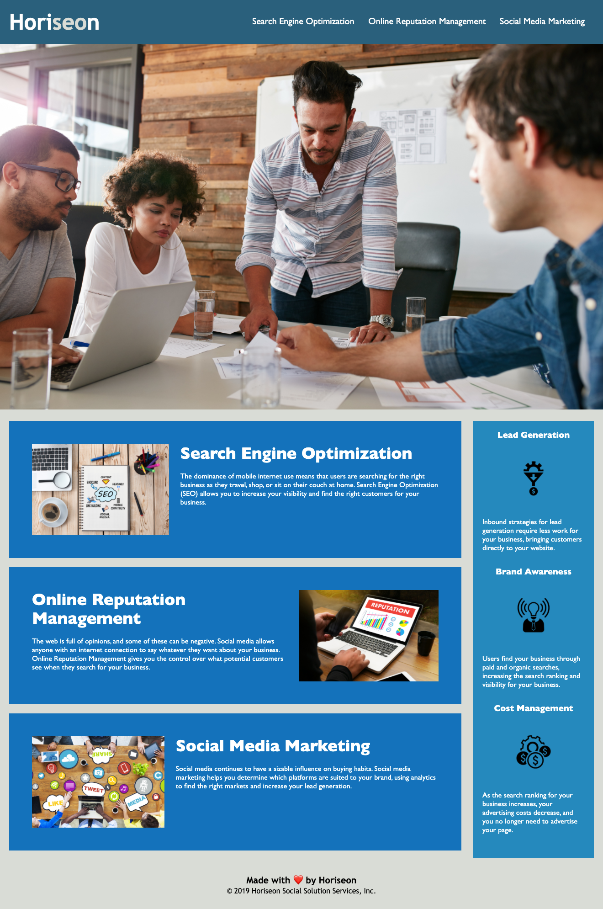

- changed the title to read company name. 
- added a redirect anchor to the header to bring you back to the home page 
- cleaned up the syntax of .html to follow a logical structure for easy viewing 
- added alt attributes to images for accessiblility 
- gathered all selectors to sit together in the style sheet 
- linked the heading attributes to jump to the coorisponding feature on the page. 
- consolidated the css classes for cleaner syntax 
- added missing '' to the font-family's (Arial, calibri and sans-serif)
- added notes to css and html files 

- Git Repo - https://github.com/theoneandonlyzako/horizon-project.git  
- Horiseon link - https://theoneandonlyzako.github.io/horizon-project/  

